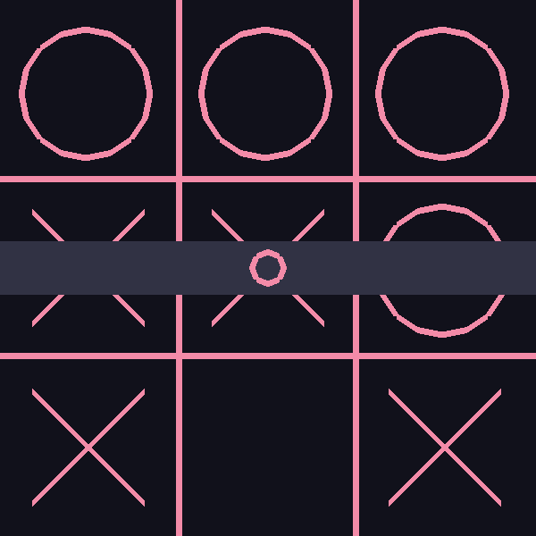

# Tic-Tac-Toe

A simple game of Tic-Tac-Toe built using SDL2 and OpenGL.

Make sure you have the SDL2 and OpenGL headers available on your system. Run the
`make` command to compile the program and then run `./tic-tac-toe` to execute it.

## Screenshots

